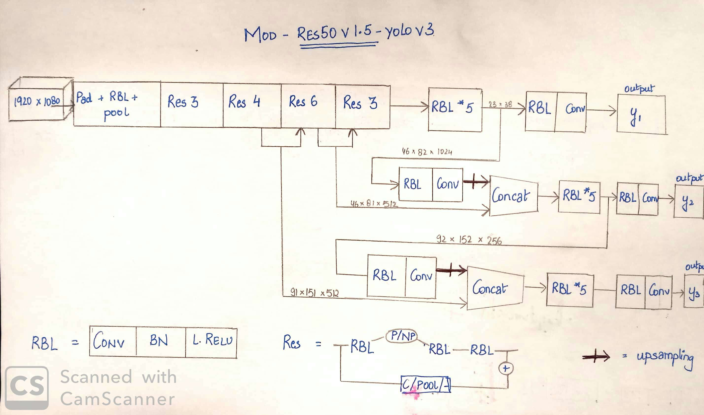

# Man vs Woman

## mod-ResNet50v1.5 yolov3 model:
This model utilizes the architecture of [Uber's model](https://gitlab-hq.wavesemi.com/WaveAI/man_vs_woman/blob/master/resource_file/resnet_v1_50_extract_1920.pb) as its feature extractor. Yolov3 has been added on top to provide detection application. Click [here](https://gitlab-hq.wavesemi.com/WaveAI/man_vs_woman/tree/master/modResv1.5Yolov3) to see the implementation.   
&nbsp;&nbsp;&nbsp;&nbsp;&nbsp;

Caveat with this model:
Bleeding edge version, many APIs are either not in the working condition or not compatible with the other existing libraries. (Ex. AMP API has not been leveraged in TF2.0 to meet the cuDNN standard, similarly for few functions, it reverts back to its stable (1.14) version, which works in graph mode.)  
However, once TF declares it as the stable version, TF2.0.1 proves to be a very strong and user friendly framework to be working with. 

Further works on this implementation includes:
1. Training the model with larger dataset, utilizing the weights and retraining to obtain better accuracy.
2. Using the weights in project/dataset folder for the model and finetuning more using the same dataset for longer epochs.
3. Implementing optimization as added in the pytorch implementation, to reduce the space and time complexity by some measure.
4. If none of the above works, change the model in model.py by replacing the feature extractor with ResNet50v1.5 and instead of changing each layer, keep the initial layers same and add further with the maxpool skip-connection.

## Yolov3_gender_detection model:
This model uses Yolov3 architecture and implements for gender detection. Extra utilities like mixed precision, optimizer accumulator has been implemented for providing faster, with larger batch-size training. Follow along [tutorial](https://gitlab-hq.wavesemi.com/WaveAI/man_vs_woman/tree/master/Yolov3_gender_detection)

### mAP with SuperMarket images:

Class | Images | Targets | P | R | mAP |
--- | --- | --- | --- |--- |--- |
all | 19600 | 42200 | 0.119 | 0.969 | 0.788 | 
man | 19600 | 31400 | 0.155 | 0.971 | 0.787 | 
woman | 19600 | 10700 | 0.0834 | 0.968 | 0.79 |

## Reference:
1. https://github.com/pjreddie/darknet
2. https://github.com/AlexeyAB
3. https://github.com/qqwweee/keras-yolo3
4. https://github.com/eriklindernoren/PyTorch-YOLOv3
5. https://github.com/ultralytics/yolov3

